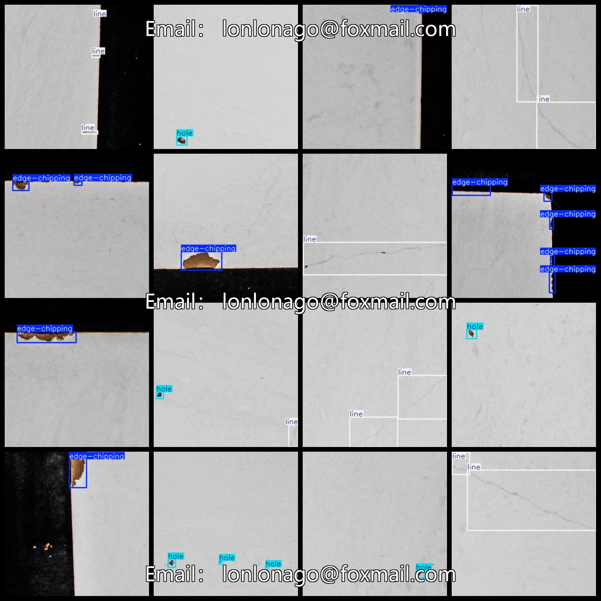
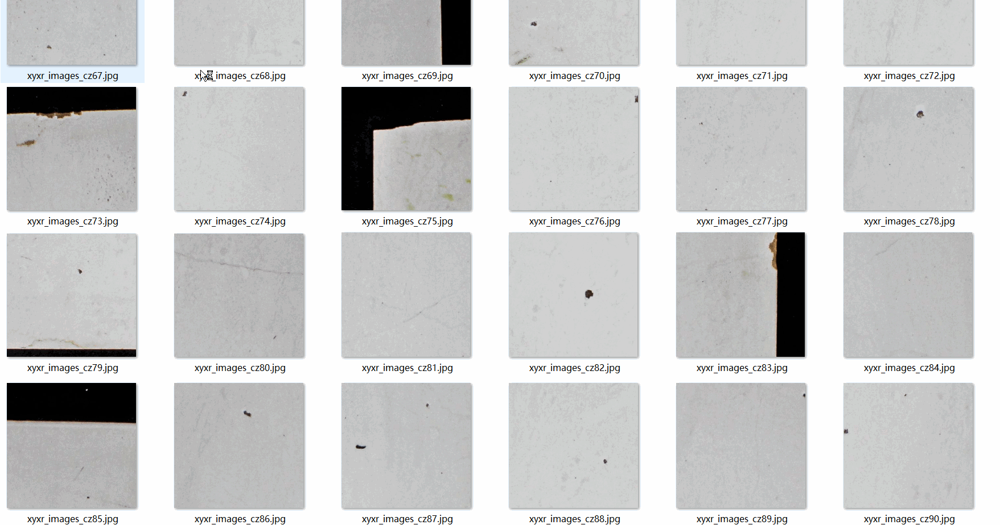

# Tile Defect Detection Dataset 2238 imagesVOC+YOLO format

The defect detection dataset of ceramic tiles consists of 2238 images in VOC+YOLO format.

Dataset format: Pascal VOC format + YOLO format (the txt file does not contain the split path, it only contains jpg images and corresponding VOC format xml files and yolo format txt files)

Number of images: 2238

Number of XML files: 2238

Number of txt files: 2238

Number of annotated categories: 3

The Github repository is: datasets_sl

["edge-chipping", "hole", "line"]

Number of boxes labeled in each category:

Edge-chipping frame count = 1077

Holes = 1696 (holes)

Line count = 877 (scratches)

Total frames: 3650

Number of images per category:

Edge-chipping occupies a total of 753 images.

Hole occupancy = 1316

Line occupies a total of 498 images.

Image resolution: Multi-resolution images, such as 401x394, 397x391, etc.

Use the labeling tool: labelImg

Dataset Augmentation: No

Rules for annotation: Draw a rectangle around the category.

Important note: The dataset does not have been divided into training, validation, and testing sets.

Special Disclaimer: This dataset does not guarantee the accuracy of the trained models or weight files.

Annotation and image details are as follows:

## Images

---

Here is a pay link on Stripe (https://buy.stripe.com/3cs8yP7sY87d0vu9AB). Please contact me lonlonago@foxmail.com after funding $89, and I will send you a complete data files, thank you!

